<h1 align="center">PAL — Local Voice Assistant for Home Assistant</h1>

<p align="center"><em>A fully local, always-listening voice assistant with a personality, a face, and a memory.<br>No cloud. No subscriptions. Everything runs on your network.</em></p>

<p align="center">
  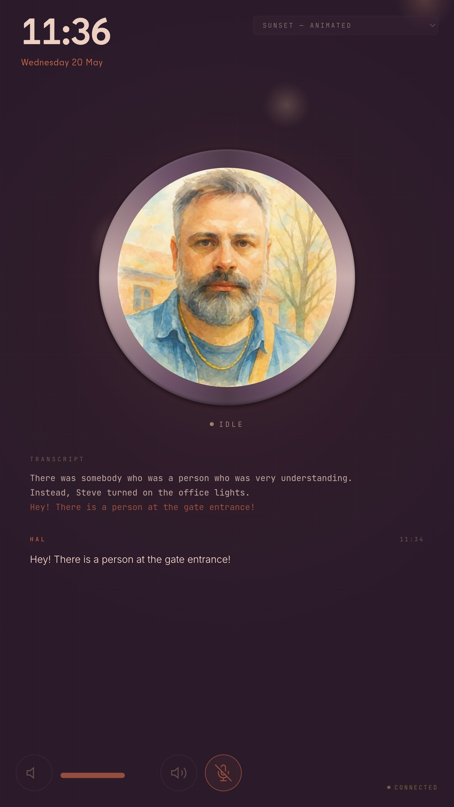
</p>

---

## What PAL does

- 🎙️ **Listens continuously** through a USB speakerphone, transcribing every utterance in the room
- 🗣️ **Talks back** in a voice you pick, through a Wyoming-protocol TTS service
- 🏠 **Controls Home Assistant** via MCP tool-calling — switches, scenes, climate, media, all of it
- 🧠 **Remembers** what you've told it (Shodh Hebbian long-term memory) so context survives across days
- 👁️ **Shows itself** through a kiosk inspired by HAL-inspired AI system designs — an animated eye and 16 switchable themes, including two with looping in-orb state videos that change with PAL's mood
- 📸 **Displays cameras, images, and videos** inside the orb (HA snapshots, live WebRTC, RTSP, HLS playlists)
- 📅 **Pops up a calendar overlay** (month / week / day) pulled from any HA calendar, on voice or HA button
- 🖼️ **Photo frame mode** — ambient full-screen image from a configurable HA `image.*` entity, white drop-shadow clock + Ken-Burns zoom, auto-crossfades when HA rotates the photo, dismisses on any kiosk action; **optional auto-activate after N minutes of inactivity**
- 💤 **Display power (DPMS)** — actually powers the panel off (not just a black overlay), with optional idle auto-blank; wakes automatically on the next wake word / PTT / TTS / takeover. Same code path on RPi (Wayland) and x86 (Wayland or X11).
- 🎯 **Wake word** *or* **Push-to-Talk** — your choice per situation (PTT triggerable from HA, an HTTP call, a WebSocket, or the desktop popup app)
- 🎵 **Multi-room audio** via an optional Music-Assistant Sendspin sidecar with PulseAudio role-ducking
- 🔌 **Speaks every protocol your house already speaks** — REST, MQTT, WebSocket — and HA auto-discovers it as a single device with sensors, switches, selects, text inputs, and buttons

Setup is two `docker compose` commands. See [Quick start](#quick-start) below.

---

## Themes

Sixteen built-in themes, switchable from the kiosk's picker, the LLM (`ui_set_theme` tool), the MQTT `Theme` select, or the auto day/night scheduler. Two of them (`birch_animated`, `sunset_animated`) declare per-state looping videos in their manifest — short clips that play inside the orb and crossfade as PAL moves between idle / listening / processing / speaking. Any theme can opt in via the `state_videos` field. Authoring guide: [`THEMES.md`](./THEMES.md).

| Preview | Theme | Vibe |
|---|---|---|
| 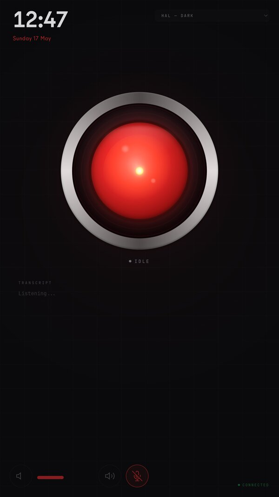 | `dark` | Classic 2001 HAL — matte black panel, deep red eye, white-hot core when speaking |
| 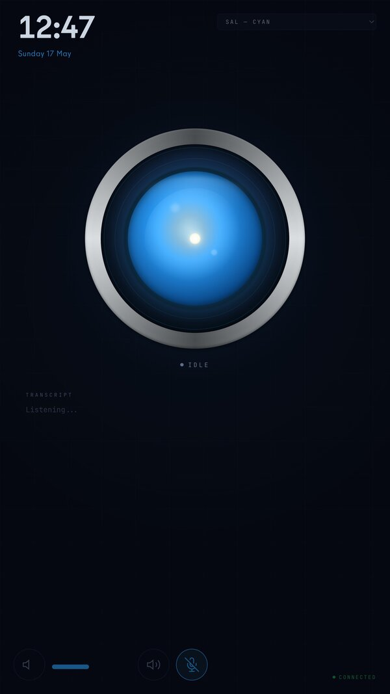 | `sal` | SAL 9000 — HAL's twin from 2010, cyan eye on deep blue-black |
| 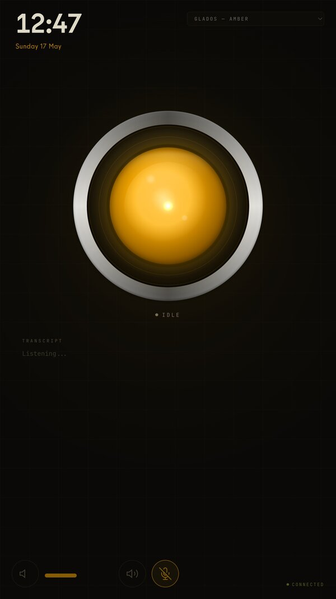 | `glados` | Portal 2 — Aperture Science amber optic on warm black |
| 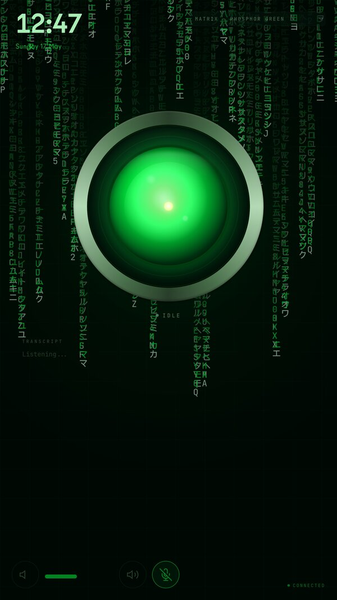 | `matrix` | Phosphor green on pitch black — old-CRT terminal with digital-rain canvas |
| 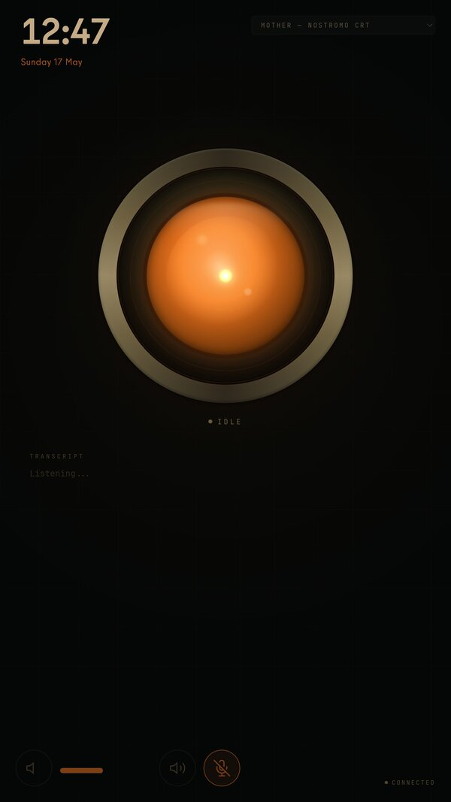 | `mother` | Alien *Nostromo* — industrial dim amber on grimy near-black |
| 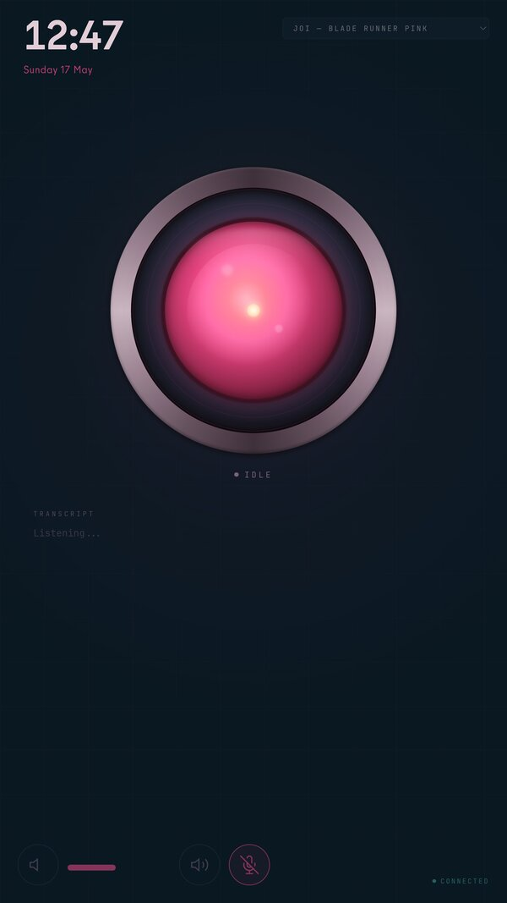 | `joi` | Blade Runner 2049 — hot pink/magenta on deep teal-blue |
| 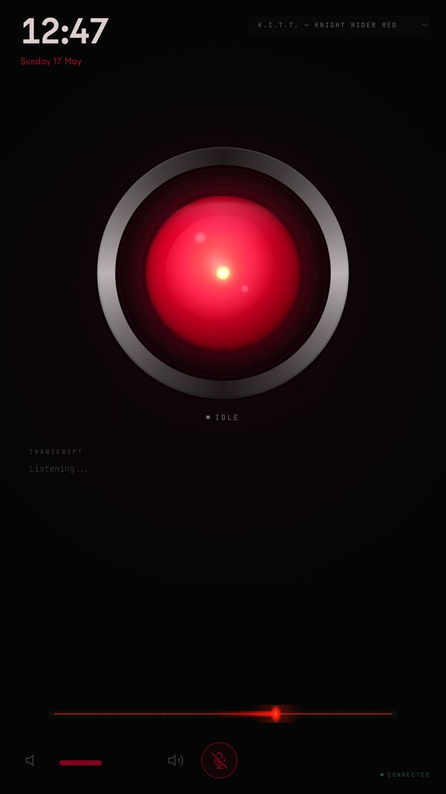 | `kitt` | Knight Rider — saturated crimson on chrome-edged black, with the iconic red scanner sweeping along the bottom |
| 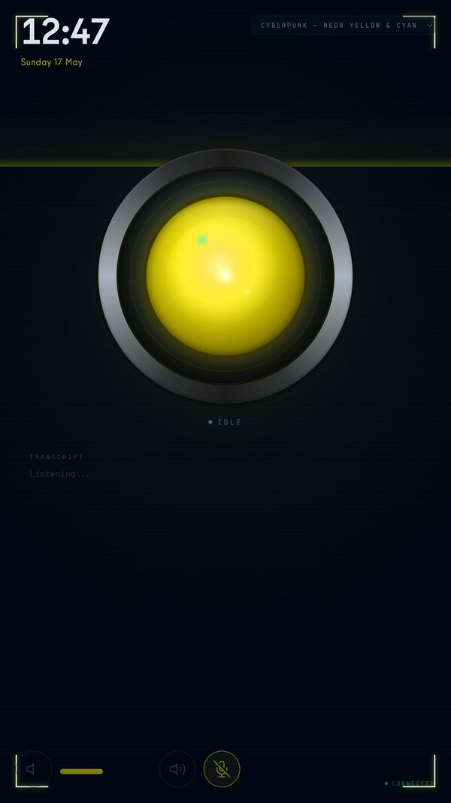 | `cyberpunk` | Night City — high-contrast neon yellow + electric cyan on black with animated scanlines and occasional glitch bars |
| 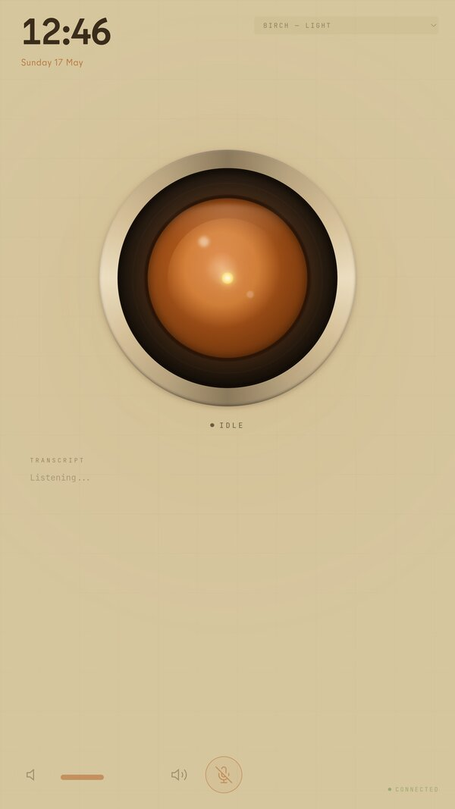 | `birch` | Warm beige Scandinavian wood tones — light-room friendly |
| 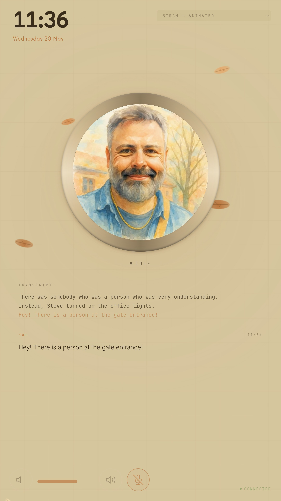 | `birch_animated` | Birch palette with stylised autumn leaves drifting across the page, plus looping in-orb state videos that change with PAL's mood |
| 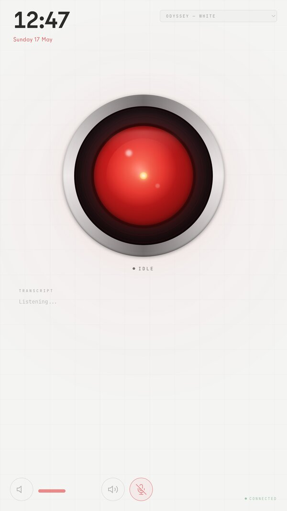 | `odyssey` | Bright white background, minimalist — for very bright rooms |
| 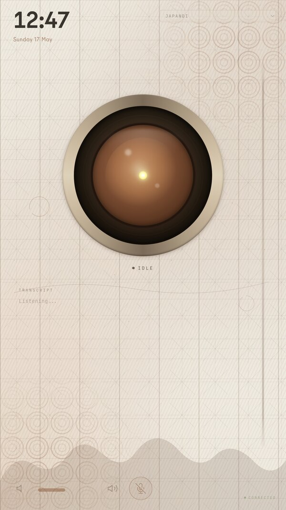 | `japandi` | Earthy Japandi with subtle decorative background patterns |
| 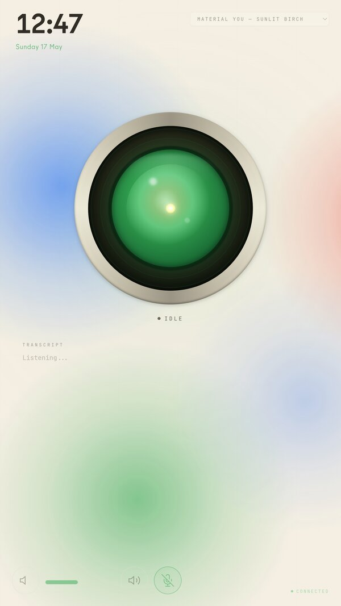 | `material_you` | Material You light theme tuned for birch wood + white furniture, with a slow lava-lamp drift of the Google brand colours in the background |
| 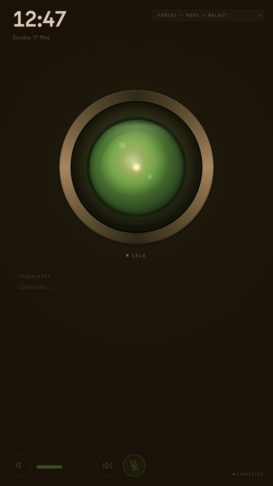 | `forest` | Moss green + amber on dark walnut — calm and organic |
| 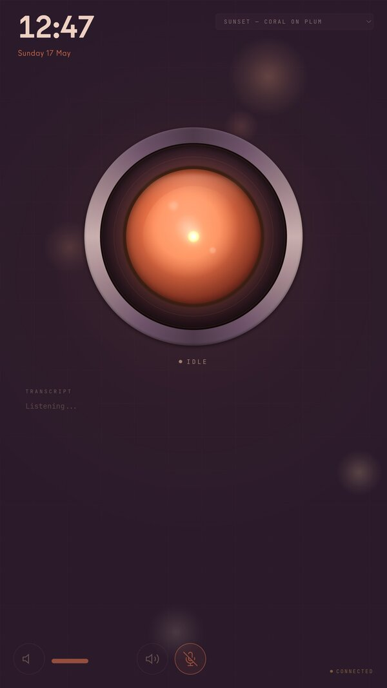 | `sunset` | Coral + peach on dusk plum — warm and gentle, with drifting golden-hour bokeh |
|  | `sunset_animated` | Sunset's plum/coral palette and bokeh drift, plus looping in-orb state videos that change with PAL's mood |

---

## How you talk to PAL

| Mode                              | What it is                                                                                                                            |
|-----------------------------------|---------------------------------------------------------------------------------------------------------------------------------------|
| **Wake word**                     | Say `"hey hal"` (or whatever `WAKE_WORD` you set), pause, then your command. Chime fires + eye flashes when wake is detected.        |
| **Push-to-Talk (PTT)**            | Bypass the wake word. Trigger via the desktop popup's hold-button, an HA dashboard button, an HTTP POST, an MQTT publish, or a persistent WebSocket. Hold-to-talk via Zigbee remote works too. See [`API.md`](./API.md#push-to-talk) + [`MQTT.md`](./MQTT.md#push-to-talk). |
| **Typed text**                    | `POST /api/command` (or write to HA's `text.<id>_command` entity, or publish to MQTT `hal/<id>/command`) — runs the full LLM round with tools. |
| **Verbatim announcement**         | `POST /api/speak` (or `text.<id>_speak`, or MQTT `hal/<id>/speak`) — PAL says the exact words you wrote, no LLM in the loop. |
| **Follow-up window**              | After a turn ends, you have ~10 s to reply without repeating the wake word.                                                          |
| **Always-on mode**                | Set `WAKE_WORD=` (empty) to process every transcribed line through the LLM.                                                           |

---

## Integrations & extension points

| Doc                                       | What's in it                                                                                                       |
|-------------------------------------------|--------------------------------------------------------------------------------------------------------------------|
| [`API.md`](./API.md)                      | Full REST + WebSocket reference (PTT, command, speak, mute, volume, snapshots, themes; `/ws/{ptt,ui,audio}`)        |
| [`MQTT.md`](./MQTT.md)                    | Every MQTT topic the bridge subscribes to or publishes; complete HA Discovery entity table; automation snippets    |
| [`THEMES.md`](./THEMES.md)                | Plug-in theme authoring (CSS variable reference, `effect.js` API, manifest schema, hot-reload behaviour)            |
| [`ARCHITECTURE.md`](./ARCHITECTURE.md)    | Pipeline walkthrough, STT engine choice, PTT internals, camera/video modes, runtime config, project structure       |
| [`openclaw-channel/hal/`](./openclaw-channel/hal/README.md) | OpenClaw channel plugin — routes voice through an OpenClaw agent with full mcporter/MCP tool access, Ollama fallback |
| `openclaw-skill/hal/SKILL.md`             | OpenClaw skill teaching the agent how to control HAL's kiosk via mcporter                                          |
| `desktop/`                                | Rust/GTK4 Wayland overlay for typing commands + hold-to-talk PTT from your Linux desktop                            |

---

## Quick start

> Two `docker compose` commands once `.env` is configured. Full env variable reference at the [bottom of this README](#configuration-reference); pipeline internals in [`ARCHITECTURE.md`](./ARCHITECTURE.md).

### Prerequisites

| Component                       | Requirement                                                                              |
|---------------------------------|------------------------------------------------------------------------------------------|
| AI Server                       | Linux box with NVIDIA GPU, Docker + nvidia-container-toolkit                             |
| Raspberry Pi                    | Pi 4/5 with Docker, USB speakerphone (e.g. Anker PowerConf S330)                         |
| Ollama                          | Running on the AI server host with a tool-calling-capable model                          |
| Home Assistant                  | Running, with an MCP server exposed over HTTP(S)                                         |
| Wyoming TTS                     | Any Wyoming-protocol TTS service (e.g. [wyoming-piper](https://github.com/rhasspy/wyoming-piper)) |
| MQTT broker *(optional)*        | Mosquitto, EMQX, the HA Mosquitto add-on — anything Paho/aiomqtt can speak v3.1.1 to     |
| Music Assistant *(optional)*    | Required only for the Sendspin multi-room sidecar                                        |

### 1. Clone and configure

```bash
git clone https://github.com/moimart/conversation-hass.git
cd conversation-hass
cp .env.example .env
# Edit .env — see the Configuration reference at the bottom
```

### 2. Start the AI server

```bash
# Pre-built (recommended for first try):
docker compose -f docker-compose.server-ghcr.yml up -d

# Or build from source:
docker compose -f docker-compose.server.yml up --build -d
```

Brings up `hal-ai-server` (port **8765**), `hal-shodh-memory` (port **3030**), and a `go2rtc` sidecar (host networking, port **1984**).

### 3. Start the Raspberry Pi

```bash
# Pre-built arm64:
docker compose -f docker-compose.rpi-ghcr.yml up -d

# Or build from source:
docker compose -f docker-compose.rpi.yml up --build -d
```

Brings up `hal-audio-streamer` (port **8080**, web UI + mic capture + speaker playback) and the optional `hal-sendspin` sidecar.

### 4. Open the kiosk

Navigate to `http://<rpi-ip>:8080`. For HA snapshots to work, launch the kiosk Chromium with the DevTools Protocol enabled:

```bash
chromium-browser --kiosk http://localhost:8080 \
  --autoplay-policy=no-user-gesture-required \
  --remote-debugging-port=9222
```

### 5. (Optional) Desktop command popup

A lightweight Rust/GTK4 Wayland overlay that types commands and hold-to-talks PTT from your Linux desktop.

```bash
cd desktop && ./install.sh
# Hyprland keybind:  bind = SUPER, H, exec, hal-command
```

---

## Pre-built images

| Image                                                                  | Platform     | Purpose                                                            |
|------------------------------------------------------------------------|--------------|--------------------------------------------------------------------|
| `ghcr.io/moimart/conversation-hass/hal-ai-server:latest`               | `linux/amd64`| FastAPI server, STT, MCP routing, MQTT bridge                      |
| `ghcr.io/moimart/conversation-hass/hal-rpi:latest`                     | `linux/arm64`| Pi audio_streamer + kiosk web UI                                   |
| `ghcr.io/moimart/conversation-hass/hal-sendspin:latest`                | `linux/arm64`| Sendspin daemon for Music Assistant                                |

Tagged versions also published (`:0.10`, etc. — the previous stable is preserved with each release for easy revert).

---

## Configuration reference

> Bootstrap-from-env on first run; runtime-changeable keys are listed in the [Live runtime config table](./ARCHITECTURE.md#live-runtime-config) — once changed from HA, the file (`server/runtime/config.json`) wins over `.env`.

### Network

| Variable             | Default                       | Description                                                          |
|----------------------|-------------------------------|----------------------------------------------------------------------|
| `AI_SERVER_HOST`     | —                             | IP of the AI server (used by RPi to connect)                         |
| `RPI_HOST`           | —                             | IP of the RPi (informational; not consumed by code)                  |
| `WEB_PORT`           | `8080`                        | Port for the RPi web UI                                              |
| `CHROMIUM_DEBUG_URL` | `http://127.0.0.1:9222`       | Kiosk Chromium's DevTools endpoint (for snapshot capture)            |
| `SNAPSHOT_INTERVAL_S`| `60`                          | Seconds between CDP screenshots posted to the AI server              |

### Speech & LLM

| Variable             | Default                              | Description                                                |
|----------------------|--------------------------------------|------------------------------------------------------------|
| `WAKE_WORD`          | `hey hal`                            | Activation phrase. Empty = always-on                       |
| `STT_ENGINE`         | `whisper`                            | `whisper` or `nemotron`                                    |
| `STT_MODEL`          | (auto per engine)                    | Whisper: `large-v3-turbo`; Nemotron: `nvidia/parakeet-tdt-0.6b-v2` |
| `OLLAMA_HOST`        | `http://localhost:11434`             | Ollama API                                                 |
| `OLLAMA_MODEL`       | `llama3.2`                           | LLM name (must support tool calling)                       |
| `OLLAMA_NUM_CTX`     | `32768`                              | LLM context window in tokens                               |
| `OLLAMA_NUM_PREDICT` | `512`                                | Max tokens per LLM response                                |
| `WYOMING_TTS_HOST`   | `localhost`                          | Wyoming TTS host                                           |
| `WYOMING_TTS_PORT`   | `10200`                              | Wyoming TTS port                                           |
| `WYOMING_TTS_VOICE`  | (server default)                     | Voice name; empty = service default                        |
| `SYSTEM_PROMPT_FILE` | `/app/system_prompt.txt`             | LLM system prompt path inside the container                |

### MCP & Memory

| Variable           | Default                              | Description                                       |
|--------------------|--------------------------------------|---------------------------------------------------|
| `MCP_SERVERS_FILE` | `/app/mcp_servers.json`              | Path to the MCP server list inside the container  |
| `MCP_SERVER_URL`   | —                                    | Single-server fallback if `mcp_servers.json` is absent |
| `MEMORY_URL`       | `http://shodh-memory:3030`           | Shodh Memory service URL                          |
| `MEMORY_USER_ID`   | `hal-default`                        | User ID for memory isolation                      |
| `MEMORY_API_KEY`   | —                                    | Shodh API key (if your instance requires auth)    |

### OpenClaw (optional agentic backend)

| Variable                | Default              | Description                                                          |
|-------------------------|----------------------|----------------------------------------------------------------------|
| `OPENCLAW_ENABLED`      | `false`              | Enable OpenClaw as conversation engine (falls back to Ollama on error) |
| `OPENCLAW_GATEWAY_URL`  | (empty)              | Gateway URL, e.g. `http://gateway-host:18789`                        |
| `OPENCLAW_WORKSPACE`    | (empty)              | Workspace name on the gateway                                        |

See [`openclaw-channel/hal/README.md`](./openclaw-channel/hal/README.md) for full setup.

### Home Assistant (live streaming, calendar, image fetch)

| Variable   | Default | Description                                                         |
|------------|---------|---------------------------------------------------------------------|
| `HA_URL`   | —       | HA base URL, e.g. `http://homeassistant.local:8123` (empty disables streaming/calendar/image-fetch) |
| `HA_TOKEN` | —       | HA Long-Lived Access Token                                          |
| `GO2RTC_URL` | `http://host.docker.internal:1984` | go2rtc HTTP/WS endpoint reachable from the AI server container |

### Audio (RPi)

| Variable      | Default   | Description                                       |
|---------------|-----------|---------------------------------------------------|
| `AUDIO_DEVICE`| `default` | ALSA device (auto-detects USB speakerphones)      |
| `SAMPLE_RATE` | `16000`   | Target audio sample rate (Hz)                     |
| `CHANNELS`    | `1`       | Target audio channels                             |
| `CHUNK_SIZE`  | `4096`    | Audio buffer size per WebSocket frame             |

### Themes

| Variable      | Default | Description                                                          |
|---------------|---------|----------------------------------------------------------------------|
| `AUTO_THEME`  | `true`  | Auto-switch themes at dusk/dawn via `sun.sun`                        |
| `THEME_DAY`   | `birch` | Theme used when sun is above horizon                                 |
| `THEME_NIGHT` | `dark`  | Theme used when sun is below horizon                                 |

### MQTT (HA auto-discovery)

| Variable           | Default              | Description                                            |
|--------------------|----------------------|--------------------------------------------------------|
| `MQTT_BROKER_HOST` | (empty = disabled)   | MQTT broker hostname/IP                                |
| `MQTT_BROKER_PORT` | `1883`               | MQTT broker port                                       |
| `MQTT_USERNAME`    | —                    | Broker username (optional)                             |
| `MQTT_PASSWORD`    | —                    | Broker password (optional)                             |
| `HAL_DEVICE_ID`    | `hal-default`        | MQTT object id (slug)                                  |
| `HAL_DEVICE_NAME`  | `HAL`                | Display name in HA                                     |
| `START_MUTED`      | `false`              | Boot with mic muted (live-toggleable from HA)          |

### Calendar overlay

| Variable                     | Default | Description                                                          |
|------------------------------|---------|----------------------------------------------------------------------|
| `CALENDAR_DEFAULT_SOURCE`    | (empty) | Default calendar name; empty = merge all HA calendars                |
| `CALENDAR_DISMISS_SECONDS`   | `30`    | Default duration the overlay stays up before auto-dismissing         |

### Sendspin (multi-room audio)

| Variable                     | Default              | Description                                                                          |
|------------------------------|----------------------|--------------------------------------------------------------------------------------|
| `SENDSPIN_PLAYER_ENTITY`     | (empty = disabled)   | MA `media_player.*` entity_id — enables button redirection and the optional Shape C  |
| `SENDSPIN_PAUSE_DURING_TTS`  | `false`              | Shape C: explicit pause/resume around TTS (only resumes if MA was playing)           |
| `SENDSPIN_LOG_LEVEL`         | `INFO`               | Sendspin daemon log level                                                            |

---

## Running tests

```bash
uv venv .venv && source .venv/bin/activate
uv pip install -r requirements-test.txt
pytest tests/ -v
```

All tests run without GPU, ML models, or external services — every external dependency (HA WS, MCP servers, TTS, audio devices, runtime config) is mocked.

---

## License

MIT
