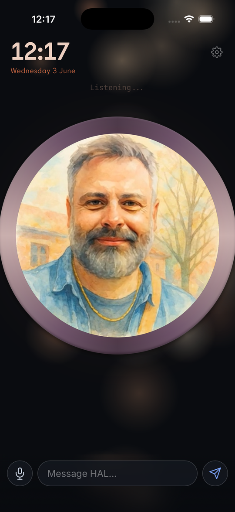
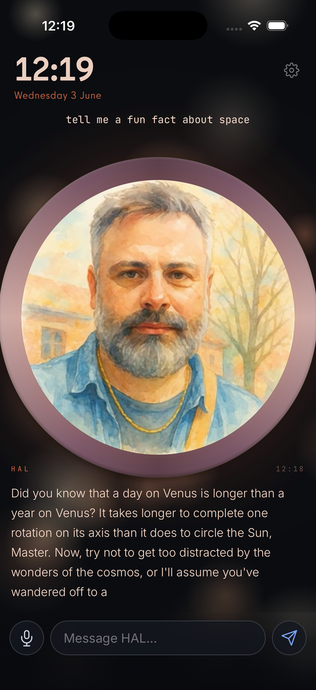

# PAL companion app (iOS + Android + watchOS + Wear OS)

A Capacitor app that pairs a phone as a **satellite** of PAL — not a mirror of
the hub. You talk to PAL by **text** or **voice**; your turn runs in the shared
household conversation, but its output (transcript, orb, reply, and PAL's
**server-voice TTS**) routes **only to your phone**, never the hub. The app
reuses the hub web UI (`rpi/web`) verbatim inside a native WebView and points it
at the AI server directly.

<p align="center">
  
  &nbsp;&nbsp;
  
</p>
<p align="center"><sub>Idle home screen · a text turn (the transcript + PAL's reply route only to this phone, spoken in PAL's server voice)</sub></p>

## How it works
- **Display**: `scripts/sync-web.mjs` copies `rpi/web` → `www/` at build time
  (single source, no fork). `src/boot.ts` reads stored config, injects
  `window.HAL_CONFIG = {serverBaseUrl, wsUrl, token, pinLandscape}`, then loads
  the copied `app.js`, which connects to the server's `ws://host:8765/ws/ui` feed
  (with `?token=` → the server classifies it as a satellite) and renders
  state/themes/photo-frame/calendar/conversation-log exactly like the hub.
  A list button next to the gear opens the **conversation log** (persistent
  household history; no auto-dismiss on mobile — close with ✕). Asking PAL to
  show it by voice from a phone opens it on that phone only.
- **Input**: a bottom overlay bar (`src/overlay`) sends text and on-device speech
  (Capacitor speech-recognition → text) to `POST /api/command` with the device
  token. The server runs the turn in the shared conversation and routes the
  transcript echo + response **back to this phone only**.
- **Server voice**: PAL's Wyoming TTS for the turn is cached server-side and
  fetched by the phone (`GET /api/satellite/tts`), played via the Web Audio API
  (`src/overlay/satellite-audio.ts` — unlocked on the send/mic tap to satisfy
  WebView autoplay policy); the orb's speaking animation is driven by that
  playback. On-device TTS is left off.
- **Household broadcasts**: proactive actions fired from voice/HA/MQTT propagate
  to every connected satellite — spoken announcements (text + voice), theme
  changes, camera/image/video on the orb, and live RTSP / HA-camera WebRTC
  streams (each phone negotiates its own peer; LAN reachability to the camera /
  go2rtc required for media).
- **Idle photo frame**: after N minutes idle the phone asks the server to start
  its own ambient photo-frame (`src/overlay/photo-frame-idle.ts`); any input —
  or an incoming broadcast — dismisses it.
- **Pairing**: first run asks for the server URL + a 6-digit code. Ask PAL to
  pair (server `POST /api/pair/request`) → the code shows on the display →
  redeem it (`/api/pair/redeem`) for a device token, stored on-device. The token
  gates `/api/command` + `/ws/ui` and identifies the satellite for routing.
- **Demo**: `src/config/demo-config.ts` ships a default URL + code pointing at a
  hosted HTTPS/WSS PAL demo instance for App Store review (you deploy that
  instance and pre-seed the demo token).

## Build
```bash
cd mobile
npm install
npm run build            # sync-web + esbuild → www/
```

### Android
Needs the Android SDK (via Android Studio or the command-line tools) and an
emulator or a connected device.
```bash
npx cap add android       # first time
npm run build && npx cap sync android
# (optional) spin up an emulator from the CLI:
sdkmanager "system-images;android-34;google_apis;x86_64"
avdmanager create avd -n hal -k "system-images;android-34;google_apis;x86_64" -d pixel_6
emulator -avd hal &
npx cap run android       # builds + installs to the running emulator/device
```
First run: enter your server URL (`http://<ai-server-ip>:8765`), then ask PAL to
pair and enter the 6-digit code shown on the hub.

### iOS
Needs a Mac with Xcode. The native project uses Swift Package Manager (no
CocoaPods step).
```bash
cd mobile && npm install && npm run build
npx cap add ios            # first time
npx cap sync ios           # resolves Swift packages + copies www/
npx cap run ios            # or open ios/App/App.xcodeproj in Xcode
```
**Info.plist** needs, for LAN cleartext + mic/speech:
`NSAppTransportSecurity → NSAllowsLocalNetworking = YES`,
`NSMicrophoneUsageDescription`, `NSSpeechRecognitionUsageDescription`.
A hosted demo over HTTPS/WSS needs no ATS exception.

## Apple Watch app (PALWatch)

A **native SwiftUI** target (`ios/App/PALWatch`, scheme `PALWatch`) — none of
the Capacitor/web stack applies on watchOS (no WebView exists there). It's a
**standalone watch-only app** (`WKWatchOnly`): on a cellular watch it needs no
phone present. Hero flow:

> tap the orb → system dictation → `POST /api/command` (`wait_reply: true`)
> via the **gateway over HTTPS** → PAL runs the command → reply text +
> success haptic on the wrist.

Design facts (each one was discovered the hard way — don't re-litigate):

- **watchOS has no Speech framework.** `SFSpeechRecognizer` does not exist in
  the watchOS SDK (verified against 26.4), so a custom in-app recognizer is
  impossible. `SpeechManager` keeps that implementation behind
  `canImport(Speech)` (compiles to a stub; lights up if Apple ever ships it)
  and the app uses the **system dictation** input instead.
- **Don't use `TextFieldLink`** — on keyboard-capable watches (Series 7+/
  Ultra) it opens QWERTY first. `WKExtension.shared()
  .visibleInterfaceController?.presentTextInputController(withSuggestions:nil,
  allowedInputMode:.plain)` presents the input directly and works from the
  SwiftUI lifecycle. watchOS then remembers the **last-used input mode**: once
  the user picks dictation (mic icon) it opens dictation-first thereafter.
- **Auth = a self-enrolled scoped token.** First launch shows `EnrollView`:
  enter PAL's LAN URL → *Show code on hub* (`POST /api/pair/request`) → type
  the 6-digit code → *Pair* (`POST /api/pair/redeem` with `scope: "watch"`).
  The `watch`-scope token + the gateway base PAL returns are persisted in
  `ConfigStore` (UserDefaults; Keychain hardening is a follow-up). The token is
  allowed on `/api/command`, `/api/pair/status`, `/api/pair/push-register`,
  403/4403 everywhere else, independently revocable. Enrollment hits the LAN
  over cleartext (pairing is LAN-only by design), so the target uses an
  **explicit `Info.plist`** (`GENERATE_INFOPLIST_FILE=NO`) carrying
  `NSAppTransportSecurity → NSAllowsLocalNetworking`. Runtime uses the HTTPS
  gateway.
- **Replies are synchronous + private.** The watch scope excludes `/ws/ui`, so
  it sends `wait_reply: true` and PAL's reply returns in the same HTTP response
  (server caps the turn at 90s; gateway proxy timeout 100s). A `wait_reply`
  turn routes to its own token, so the **hub stays quiet** — like a phone
  satellite.
- **Push haptics — free via iPhone mirroring.** The iPhone already has PAL
  APNs push; watchOS mirrors its notifications to the wrist when the iPhone is
  locked, so finished timers/announcements buzz the Ultra with no watch code.
  (Independence from iphone-lock would need native watch APNs — parked.)
- **Quick-launch = a WidgetKit complication** (`ios/App/PALComplication`, an
  app-extension embedded in PALWatch): a mic-orb on the watch face that
  launches the app. Add it via Edit → Complications → PAL.

### Build & run (watch)

```bash
# simulator
xcodebuild -project ios/App/App.xcodeproj -scheme PALWatch \
  -destination 'generic/platform=watchOS Simulator' build

# physical watch (signed; needs the watch registered in the developer portal)
xcodebuild -project ios/App/App.xcodeproj -scheme PALWatch \
  -destination 'platform=watchOS,id=<coredevice-id>' -allowProvisioningUpdates build
xcrun devicectl device install app --device <coredevice-id> <DerivedData>/Build/Products/Debug-watchos/PALWatch.app
xcrun devicectl device process launch --device <coredevice-id> sh.martinez.pal.companion.watchkitapp
```

First-time physical-deploy gotchas (in the order you'll hit them):

1. **Developer Mode** on the watch (Settings → Privacy & Security) only
   *appears* after Xcode has connected to the watch once — which needs the
   paired **iPhone cabled to the Mac** with Xcode's Devices window open.
2. The watch must be **registered in the developer portal** before a dev
   profile can include it (App Store Connect API `POST /v1/devices` with the
   hardware UDID, or Xcode GUI) — an App-Manager API key can't cloud-register
   it through `xcodebuild`.
3. The Mac↔watch CoreDevice tunnel is **flaky without the iPhone cabled**:
   keep the watch awake + phone nearby. A failed remote *launch* right after
   a successful install usually just means the watch screen is locked — open
   the app on the watch instead.
4. `WKWatchOnly` and `WKRunsIndependentlyOfCompanionApp` are mutually
   exclusive — defining both fails the install.

Parked (tracked in the watch plan): native watch APNs (push independent of
iPhone-lock), home/gateway failover, optional TTS reply, Keychain hardening.

## Pixel Watch app (Wear OS)

A **native Kotlin/Compose** project at `wear/` (separate Gradle project, clear
of `cap sync`; same `applicationId` `sh.martinez.pal.companion`). Same hero
flow as the Apple Watch, but Wear is far easier to iterate: builds with the
linux SDK, deploys by **adb over WiFi** (no Mac, no provisioning profiles).

- **In-app live recognition works here.** Unlike watchOS, Android exposes
  `android.speech.SpeechRecognizer`, so the orb stays on screen with a live
  partial transcript (Path B). `isOnDeviceRecognitionAvailable` is currently
  false on the Pixel Watch 3 → recognition is network-backed (audio leaves the
  wrist); falls back to the `ACTION_RECOGNIZE_SPEECH` intent if no backend.
- **Enrollment** mirrors the Apple Watch (`EnrollScreen`: type the hub code →
  `redeem` scope=watch → persist in `ConfigStore`/SharedPreferences).
  `usesCleartextTraffic` for the LAN redeem; runtime uses the HTTPS gateway.
- **Push haptics — native FCM.** The watch registers its own FCM token
  (`PushRegister` → `/api/pair/push-register`); finished timers buzz the wrist
  while closed — no server change (it's "another android device" to PAL's
  `FcmSender`). Channels `timers`/`announcements` match `build_fcm_message`;
  manifest sets `NO_BRIDGING` so a paired Android phone's PAL notification
  doesn't double up. Needs `google-services.json` in `wear/app/` (reuse the
  phone app's — same package; gitignored).
- **Quick-launch = a Tile** (`PttTileService`): one swipe from the face → a
  "Talk to PAL" orb → tap launches straight into listening (the
  `EXTRA_START_PTT` flag the activity arms on first composition).

```bash
cd wear
./gradlew :app:assembleDebug
adb connect <watch-ip>:<port>           # Wireless debugging → pair, then connect
adb -s <watch-ip>:<port> install -r app/build/outputs/apk/debug/app-debug.apk
```
Wear gotchas: the watch must be on the **same subnet** as the dev box; mDNS may
misreport its IP (trust the watch's own Settings IP, the *port* is right);
wireless debugging auto-disables when idle and the port rotates.

## Layout
```
src/boot.ts            entry: config → display → overlay
src/config/            HalConfig (Preferences) + demo defaults
src/display/inject.ts  injects display.html body + loads app.js
src/overlay/           input bar, mic (STT), command, hide-hub CSS,
                       satellite-audio (server-voice TTS), photo-frame-idle
src/onboarding/        server URL + pairing screens, redeem client
src/platform/          keep-awake/status-bar/splash/resume wrappers
scripts/               sync-web + build (esbuild)
www/                   build output (gitignored)
android/ ios/          native projects (committed after `cap add`)
ios/App/PALWatch/      native SwiftUI Apple Watch app (PTT + enrollment)
ios/App/PALComplication/  watch-face complication (WidgetKit app-extension)
wear/                  native Kotlin/Compose Pixel Watch app (separate gradle)
```

## Notes / follow-ups
- Token is stored via `@capacitor/preferences` (app-sandboxed). Hardening
  follow-up: move it to Keychain/Keystore via a secure-storage plugin.
- HLS (`.m3u8`) `play_video` uses the CDN hls.js (best-effort; offline → skip).
- Live streams (RTSP / HA-camera WebRTC) are peer-to-peer to the camera /
  go2rtc, so the *media* only reaches a phone on the same LAN; text, voice,
  themes, and snapshots work from anywhere the server is reachable.
- Validated on a physical Android phone + Android emulator + iOS Simulator:
  satellite turn routing, server-voice TTS playback, orb speaking animation,
  and household broadcasts (incl. live HA-camera streams). Still worth a longer
  hardware soak for mic STT cadence, keep-awake, and WS reconnect-on-resume.
